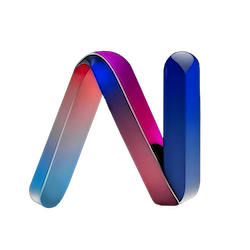

# Go Inoai

Custom Ethereum Protocol for the InoAi Ecosystem

Automated builds are available for stable releases and the unstable master branch. Binary archives are published at [Ethereum Downloads](https://geth.ethereum.org/downloads/).

## Overview

Go Inoai is a customized implementation of the Ethereum protocol designed for the InoAi ecosystem. It offers enhanced features and seamless integration with the InoAi blockchain network.

## Features

- Enhanced security protocols
- Optimized network performance
- User-friendly interfaces and tools

## Resources

For more information and detailed instructions, please visit:

- [API Reference](https://pkg.go.dev/github.com/ethereum/go-ethereum?tab=doc)
- [Go Report Card](https://goreportcard.com/report/github.com/ethereum/go-ethereum)
- [Travis CI](https://app.travis-ci.com/github/ethereum/go-ethereum)
- [Discord Community](https://discord.gg/nthXNEv)
- [Official Downloads](https://geth.ethereum.org/downloads/)

## License

This project is licensed under the MIT License - see the [LICENSE](LICENSE) file for details.

